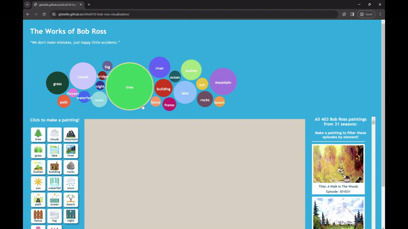
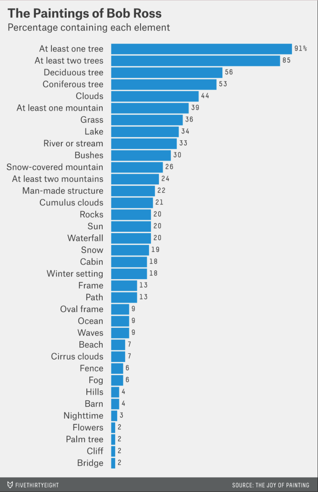

# [Bob Ross Visualization](https://gitstelle.github.io/info4310-bob-ross-visualization/)

This was a group project authored by Estelle Hooper, Eva Ruse, and Gaby Chu for INFO 4310: Interactive Information Visualization in spring 2023. We were prompted to "critique an existing data visualization and then construct an improved, interactive visualization that accomplishes similar goals and
exceeds the source visualization."

## Table of Contents

- [Bob Ross Visualization](#bob-ross-visualization)
  - [Table of Contents](#table-of-contents)
  - [Overview](#overview)
    - [Techniques](#techniques)
    - [Data](#data)
  - [Acknowledgements/References](#acknowledgementsreferences)
  - [License](#license)

## Overview

You can access our project [here!](https://gitstelle.github.io/info4310-bob-ross-visualization/)

We chose to improve this visualization from ["The Statistical Works of Bob Ross](https://fivethirtyeight.com/features/a-statistical-analysis-of-the-work-of-bob-ross/) on FiveThirtyEight depicting the distribution of elements in Bob Ross's work. We were inspired to explain this distribution by reincorporating artistic elements. Rather than a bar chart, opt for an interactive bubble chart. We also have the user "make a painting," in which they can select from those same elements to appear on a canvas. This also acts as a filter for a table containing images of all of Bob Ross' paintings in the dataset. Interacting with the bubble chart and the painting can help inform why some elements are commonly together based on the table's output.

### Techniques
HTML, CSS, JavaScript (d3.js), python (data cleaning)

### Data
[(Back to top)](#table-of-contents)

- `elements-by-episode.csv` [the raw data](https://github.com/fivethirtyeight/data/blob/master/bob-ross/elements-by-episode.csv)
- `bob_ross.csv` - preprocessed in Python, narrowed the 61 original categories for elements to 21. It contains an observation for each episode, and features the episode number, episode'painting title, and binary variables for the 21 elements (1=contains 0=doesn't contain). Used for the filtering and table.
- `bob_ross_counts.csv` - contains the counts for each element. Used for the bubble chart.

## Acknowledgements/References

[(Back to top)](#table-of-contents)

Thank you to Professor Rzeszotarski and the INFO 4310 course staff!

## License
[(Back to top)](#table-of-contents)

[MIT License](https://opensource.org/license/mit/)